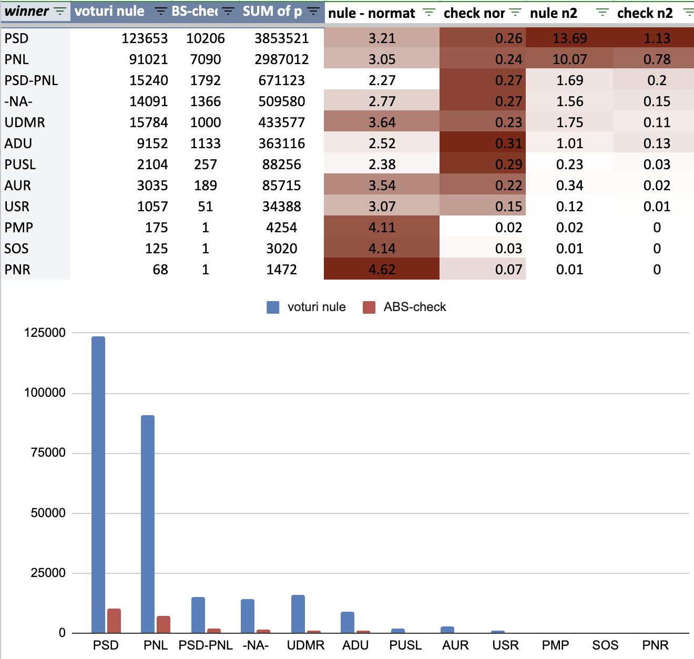
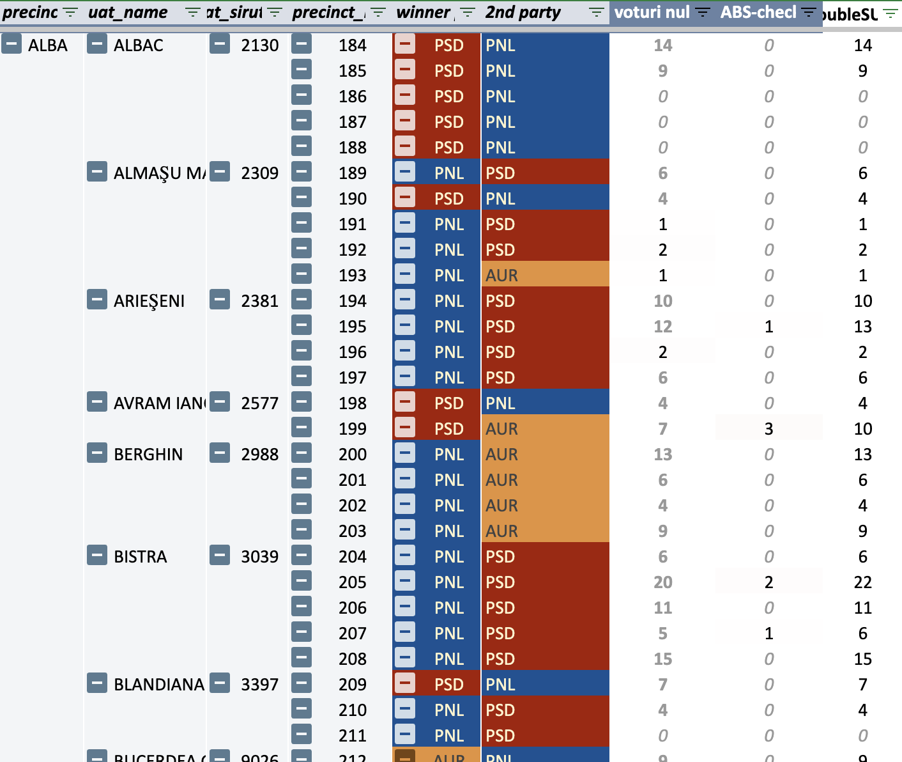
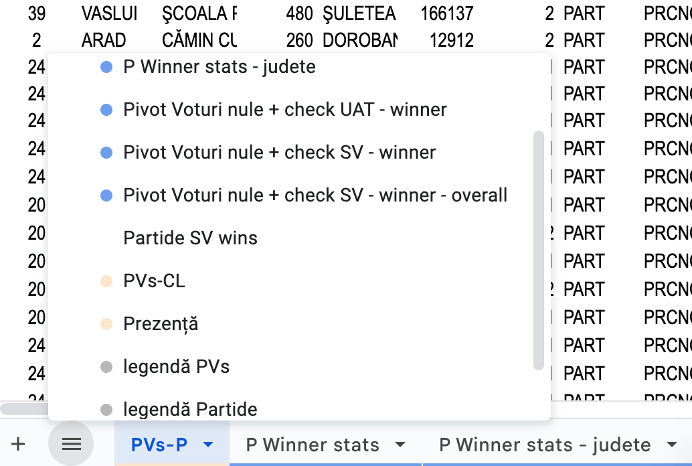
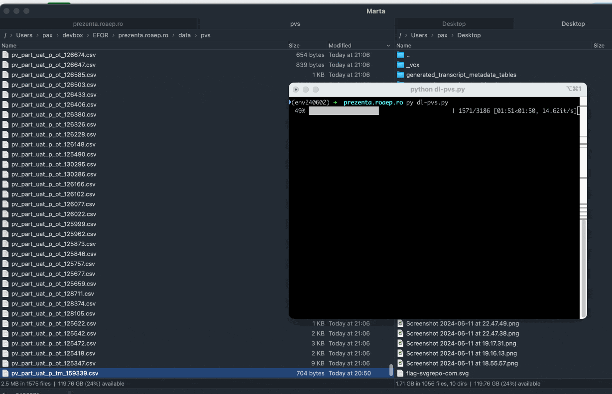

Downloadează (și agregă) date despre rezultate și prezență la vot publicate pe [prezenta.roaep.ro](https://prezenta.roaep.ro/) 

- Prezență vot: [consolidated-euro.xlsx](https://docs.google.com/spreadsheets/d/1Rynf1Ns5H1-j0RVtdlvD71mYWL09_B4i/edit?usp=sharing&ouid=110866595781073302984&rtpof=true&sd=true), [consolidated-locale.xlsx](https://docs.google.com/spreadsheets/d/1Ryn5gShIYUN3hjcrSUZurkZBfEQJVHyA/edit?usp=drive_link&ouid=110866595781073302984&rtpof=true&sd=true)    
- PVs: [primărie](https://docs.google.com/spreadsheets/d/1SJQjSnJlN1IeoQ38sXAIBM2LBtrj5Wo_/edit?usp=drive_link&ouid=110866595781073302984), [CL](https://docs.google.com/spreadsheets/d/1SJwARd3E-GEqKiwMhnlfMQP3ayxH11dQ/edit?usp=drive_link&ouid=110866595781073302984) 
- **Agregat**: [verificare-locale PVs + prezenta](https://docs.google.com/spreadsheets/d/1S4K92YJPrIUTOYLAEWafUJvKp04XojPg/edit?gid=1765616260)

## Scripts

Prezență vot
- dl-prezenta.py
- merge-jsons-prezenta.py
- merge-csvs-prezenta.py #TODO: 

Rezultate (procese verbale)
- dl-pvs.py
- merge-pvs-aggregate.py – ignoră rezultatele / voturile individuale
- merge-pvs-rezultate.py

----

$ python **`dl-prezenta.py`**` --data `_`09062024`_` --alegeri `_`locale`_` --t_start `_`19`_` --t_end `_`22`_  

- data: _ddmmyyyy_ (27092020, 11102020, 27062021, 09062024)
- alegeri: _locale, europarlamentare_ 
- t_start: int (8 - 22)  
- t_end: int (8 - 22)

----

$ python **`dl-pvs.py`**`--data `_`09062024`_` --alegeri `_`locale`_` --pv-type `_`final`_` --uat `_`cnty`_` --functie `_`p`_  

- data: _ddmmyyyy_
- alegeri: _locale*, europarlamentare_ 
- pv-type: _temp, part, final*_ 
- uat: _uat, cnty*, cntry_ 
- functie: _p*, cl, cj, pcj, eup_

\* default values

----

### Output

- \<data_scrutin\>-\<tip_alegeri\>/
    - prezenta/
        - csvs/
        - jsons/
        - consolidat/
    - pvs
        - \<functie\>/\<tip_uat\>/
            - consolidat/
- judete.csv
- uat-siruta.csv

---

## Roadmap

-[x] dl prezență
-[x] concatenate prezență
-[x] dl PVs
-[x] concatenate PVs
-[x] add params
-[ ] consolidate to sqlite db
-[ ] analytics
-[ ] election day version - main executable, get timerange from site
-[ ] UI / dashboards

