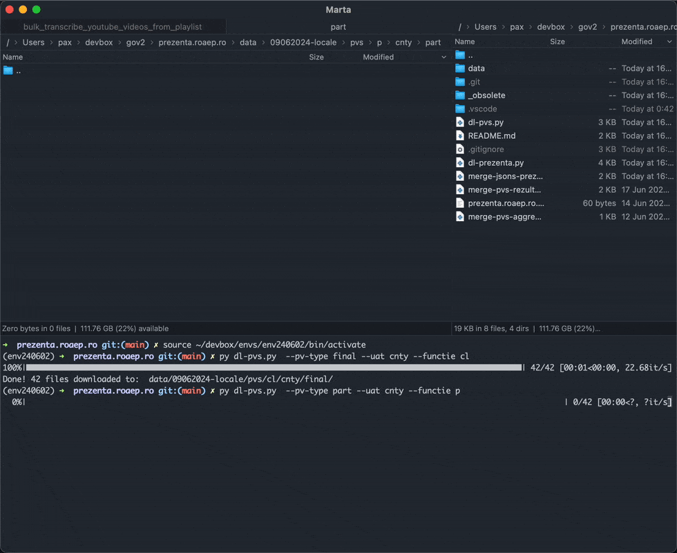
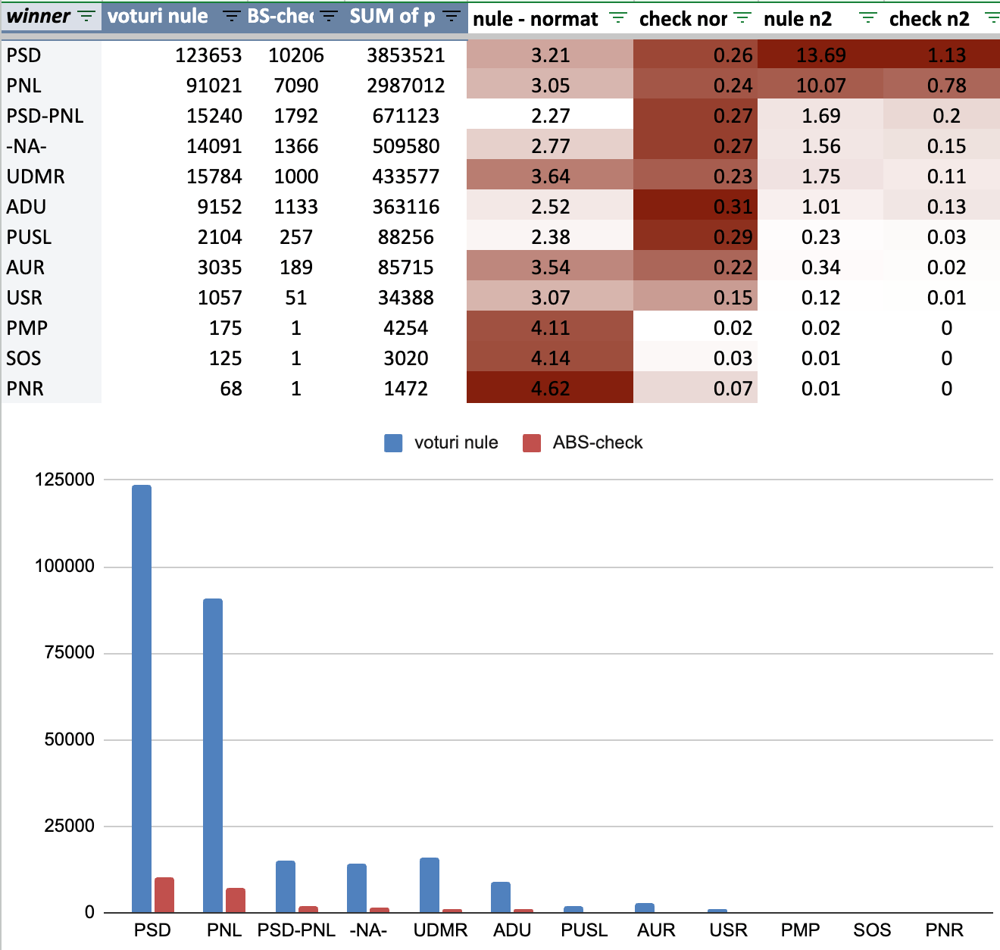

Downloadează (și agregă) date despre rezultate și prezență la vot publicate pe [prezenta.roaep.ro](https://prezenta.roaep.ro/) 

- Prezență vot: [consolidated-euro.xlsx](https://docs.google.com/spreadsheets/d/1Rynf1Ns5H1-j0RVtdlvD71mYWL09_B4i/edit?usp=sharing&ouid=110866595781073302984&rtpof=true&sd=true), [consolidated-locale.xlsx](https://docs.google.com/spreadsheets/d/1Ryn5gShIYUN3hjcrSUZurkZBfEQJVHyA/edit?usp=drive_link&ouid=110866595781073302984&rtpof=true&sd=true)    
- PVs: [primărie](https://docs.google.com/spreadsheets/d/1SJQjSnJlN1IeoQ38sXAIBM2LBtrj5Wo_/edit?usp=drive_link&ouid=110866595781073302984), [CL](https://docs.google.com/spreadsheets/d/1SJwARd3E-GEqKiwMhnlfMQP3ayxH11dQ/edit?usp=drive_link&ouid=110866595781073302984) 
- **Agregat**: [verificare-locale PVs + prezenta](https://docs.google.com/spreadsheets/d/1S4K92YJPrIUTOYLAEWafUJvKp04XojPg/edit?gid=1765616260)

## Scripts

### Prezență vot
- `dl-prezenta.py`
- `merge-jsons-prezenta.py`
- `merge-csvs-prezenta.py` #TODO: 

### Rezultate (procese verbale)
- `dl-pvs.py`
- `merge-pvs.py`
- `run_merge_scripts.sh` - orchestrates _merge-pvs.py_ with different parameters

### SQLite
- `xlsx2sqlite.py`

----

$ python **`dl-prezenta.py`**` --data 09062024 --alegeri locale --t_start 19 --t_end 22`

- data: _ddmmyyyy_ (27092020, 11102020, 27062021, 09062024)
- alegeri: _locale, europarlamentare_ 
- t_start: int (8 - 22)  
- t_end: int (8 - 22)

----

$ python **`dl-pvs.py`**` --data 09062024 --alegeri locale --pv-type final --uat cnty --functie p`

- data: _ddmmyyyy_
- alegeri: _locale*, europarlamentare_ 
- pv-type: _temp, part, final*_ 
- uat: _uat, cnty*, cntry_ 
- functie: _p*, cl, cj, pcj, eup_

\* default values

----

### Data / Output

- \<data_scrutin\>-\<tip_alegeri\>/
    - prezenta/
        - csvs/
        - jsons/
        - consolidat/
    - pvs
        - \<functie\>/\<tip_uat\>/\<tip_uat\>/*.csv
        - merged-\<functie\>-\<tip_uat\>-\<tip_uat\>.xlsx
        - merged-\<functie\>-\<tip_uat\>-\<tip_uat\>.db
- static/
    - judete.csv
    - uat-siruta.csv

---

## Roadmap

- [x] dl prezență
- [x] concatenate prezență
- [x] dl PVs
- [x] concatenate PVs
    - [ ] detect common columns
- [x] add params
- [ ] consolidate to sqlite db
    - [x] individuale
    - [ ] master db?
    - [ ] public Datasette?
- [ ] analytics
- [ ] UI / dashboards
- [ ] election day version - main executable, get timerange from site

---

